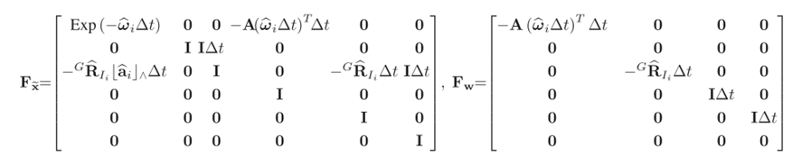
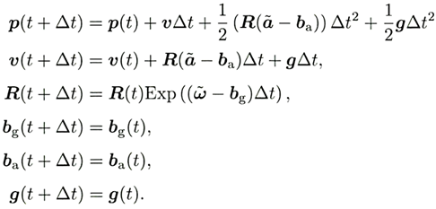

# 学习记录
## 代码位置+内容

### include/ieskf_slam/type/Point.hpp

EIGEN_ALIGN16
要求该结构体按 16 字节对齐，适配 Eigen 库的向量运算（提高性能，避免内存对齐错误）。
PCL_ADD_POINT4D
PCL 的宏，自动添加点的三维坐标字段：
float x, y, z：三维坐标。
隐含一个float data[4]数组（兼容 PCL 内部存储，data[0]=x, data[1]=y, data[2]=z, data[3]=1.0）。
EIGEN_MAKE_ALIGNED_OPERATOR_NEW
Eigen 库的宏，确保该结构体在动态分配（如new）时也能满足 16 字节对齐要求。
POINT_CLOUD_REGISTER_POINT_STRUCT
PCL的核心宏，用于将自定义点类型注册到 PCL 系统中，使其能被 PCL 的算法（如滤波、分割、可视化）识别和处理。
#pragma once
只编译一次？

### include/ieskf_slam/type/PointCloud.hpp

using// 给复杂类型定义别名（如模板类型）
using PCLPointCloud = pcl::PointCloud<Point>;  // 你的代码中用到的
PCLPointCloud cloud;  // 等价于 pcl::PointCloud<Point> cloud;

td::shared_ptr
是 C++ 的共享智能指针，会自动跟踪对象的引用计数：
当没有指针引用对象时，自动释放内存，避免内存泄漏。

### include/globalDefine.hpp
通过在CMakeists.txt中添加add_definitions(-DPROJ_DIR="${CMAKE_CURRENT_SOURCE_DIR}")将项目路径设置为全局宏

### include/ros_include/aviaProcess.hpp
继承的父类commonlidar，实际使用时定义父类指针，根据雷达类型调用子类的函数

### src/ieskf_slam/ieskf.cpp
size_t非负整数 头文件<cstddef>
.normalize() 归一化处理 单位向量

李群李代数 伴随矩阵？

### src/ieskf_slam/frontEnd.cpp
.normal() 求模

### src/ieskf_slam/mapManager.cpp
.cast<float>()将矩阵转换成float类型

###
